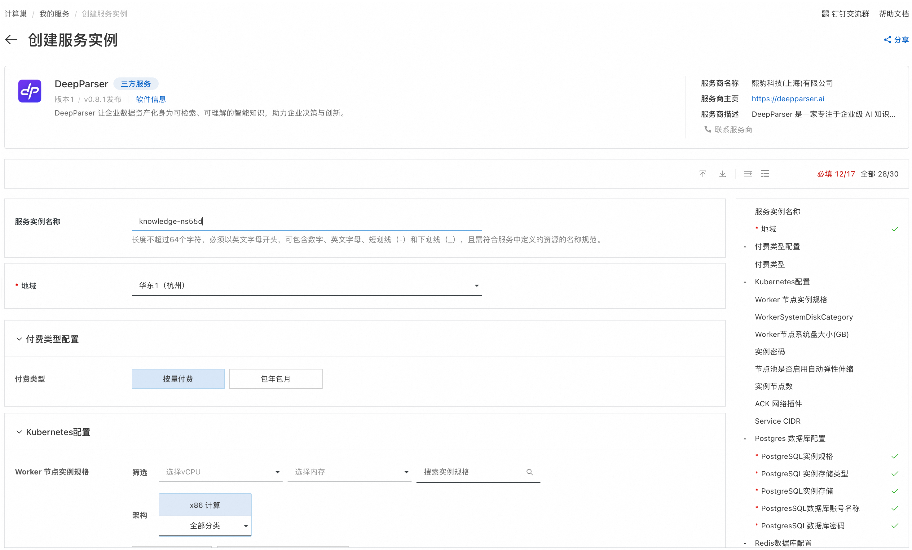
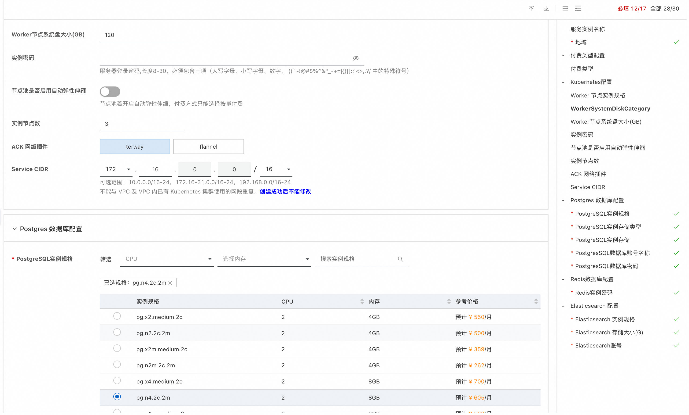
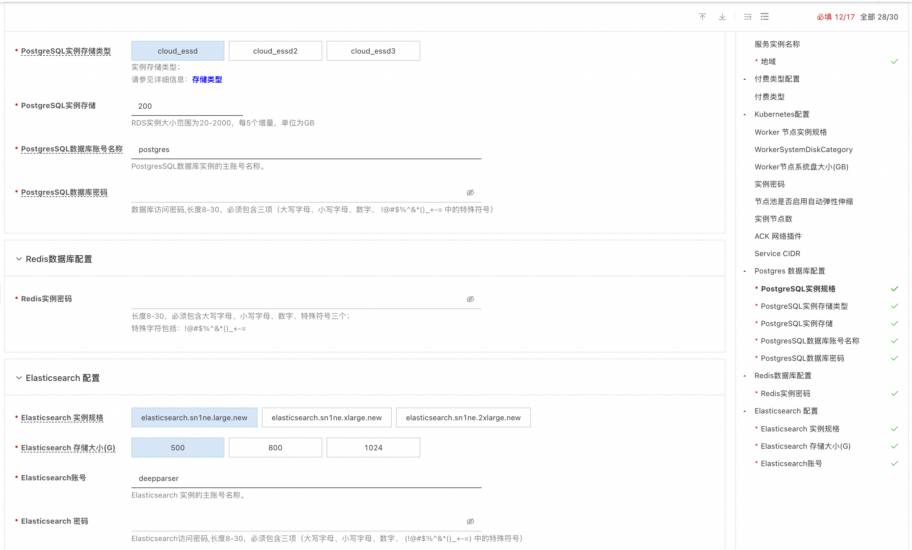
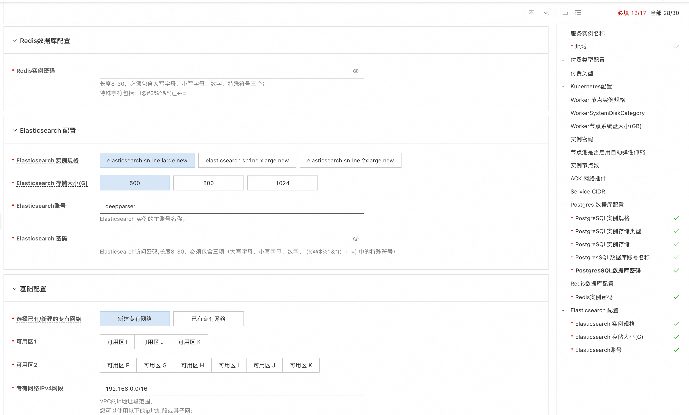
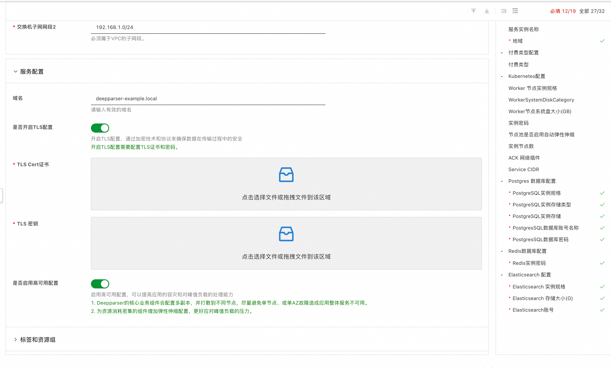
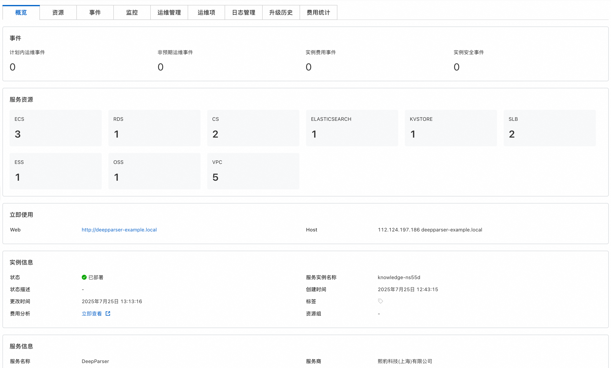
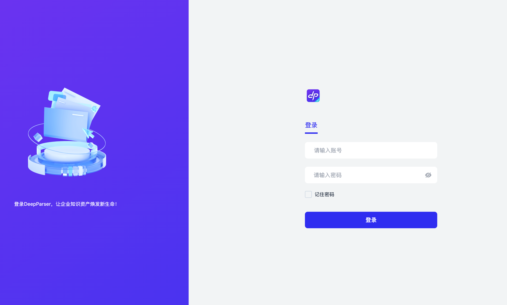
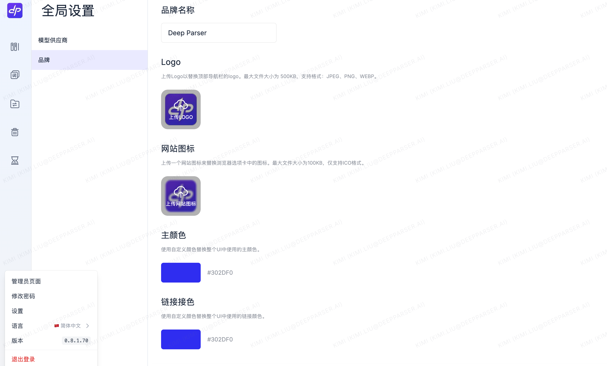
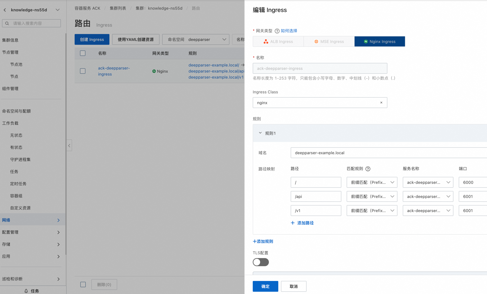
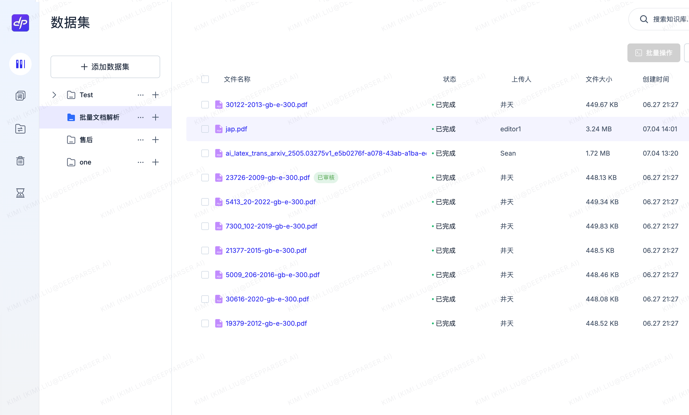

# Deepparser

>**免责声明：**本服务由第三方提供，我们尽力确保其安全性、准确性和可靠性，但无法保证其完全免于故障、中断、错误或攻击。因此，本公司在此声明：对于本服务的内容、准确性、完整性、可靠性、适用性以及及时性不作任何陈述、保证或承诺，不对您使用本服务所产生的任何直接或间接的损失或损害承担任何责任；对于您通过本服务访问的第三方网站、应用程序、产品和服务，不对其内容、准确性、完整性、可靠性、适用性以及及时性承担任何责任，您应自行承担使用后果产生的风险和责任；对于因您使用本服务而产生的任何损失、损害，包括但不限于直接损失、间接损失、利润损失、商誉损失、数据损失或其他经济损失，不承担任何责任，即使本公司事先已被告知可能存在此类损失或损害的可能性；我们保留不时修改本声明的权利，因此请您在使用本服务前定期检查本声明。如果您对本声明或本服务存在任何问题或疑问，请联系我们。

## 概述

DeepParser.AI 是面向企业的 AI 知识引擎，以“让每一份数据都能被理解”为使命，通过多模态解析与企业级安全双轮驱动，把沉睡的文档、图片、表格变成可检索、可对话的智能资产。
在解析层面，DeepParser 先以自研 CV 模型识别版面元素，再调用多模态大模型为图片生成精准文字描述，实现“所见即问答”；针对内部票据、工程图纸等专属格式，企业可再训练 CV 模型，两周内即可上线定制解析能力。
安全方面，产品内嵌细粒度权限管控：可按用户、角色或部门划定数据集访问边界，并与企业 SSO 无缝集成；同一份知识库可同步到 Dify、百炼等多个工作空间，既避免重复建设，又满足隔离要求。底层支持 K8s 集群化部署，分钟级弹性扩容，保障 7×24 高可用。
目前 DeepParser 已在金融、医疗、制造等 多个行业落地。选择 DeepParser，就是让大模型真正读懂企业知识，把数据转化为决策力与竞争力。

## 前提条件

部署Deepparser社区版服务实例，需要对部分阿里云资源进行访问和创建操作。因此您的账号需要包含如下资源的权限。
**说明**：当您的账号是RAM账号时，才需要添加此权限。

| 权限策略名称                          | 备注                         |
|---------------------------------|----------------------------|
| AliyunECSFullAccess             | 管理云服务器服务（ECS）的权限           |
| AliyunVPCFullAccess             | 管理专有网络（VPC）的权限             |
| AliyunROSFullAccess             | 管理资源编排服务（ROS）的权限           |
| AliyunCSFullAccess             | 管理容器服务（CS）的权限              |
| AliyunROSFullAccess             | 管理资源编排服务（ROS）的权限           |
| AliyunKvstoreFullAccess             | 管理云数据库Tair（兼容 Redis）的权限    |
| AliyunRDSFullAccess             | 管理云数据库服务（RDS）的权限           |
| AliyunOTSFullAccess             | 管理 Elasticsearch 的权限       |
| AliyunComputeNestUserFullAccess | 管理计算巢服务（ComputeNest）的用户侧权限 |

## 计费说明

Deepparser在计算巢部署的费用主要涉及：

- 所选vCPU与内存规格
- 系统盘类型及容量
- 公网带宽
- 所选的云数据库的规格

Deepparser应用的组件主要包括业务组件和基础组件两大类，业务组件包括：api/worker、web、sandbox。基础组件包括：db、verctor db、redis、nginx、ssrf_proxy。
此方案中基础组件既可以选择社区开源的redis、postgres以及weaviate，也可以选择阿里云的云数据库，如果您对这些基础组件有更高的性能、功能和SLA要求、或者对基础组件有运维和管理的压力，推荐使用云数据库。

## 部署流程
1. 访问计算巢Deepparser[部署链接](https://computenest.console.aliyun.com/service/instance/create/cn-shanghai?type=user&ServiceId=service-d7680f26618c43b39855)按提示填写部署参数：
   模板选择"高可用版"，配置Kubernetes, 如果想使用已有的ACK集群，需要选择ACK集群Id,为了提高部署成功率和稳定性，推荐使用新建容器集群，如果选择已有ACK,最后需要手动进行服务访问配置。
   
   若选择"默认新建容器集群"，需要配置节点规格、节点密码等。
   
   配置Postgres数据库，需要进行相关配置
   
   配置Reids数据库，需要进行相关配置
   
   配置Elasticsearch，保持默认值即可
   配置网络参数，可以选择新建专有网络, 也可以选择已有专有网络，选择两个可用区，提高服务可用性。
   
   进行服务相关配置，如果您有可用的域名，可填写您自己的域名，否则默认使用计算巢提供的测试域名，测试域名需要绑定host后使用，否则无法访问。
   如果需要开启TLS配置，需要上传TLS证书
   建议开启高可用配置，开启后可以提高应用的容灾能力和对峰值负载的处理能力。
2. 参数填写完成后可以看到对应询价明细，确认参数后点击**下一步：确认订单**。 确认订单完成后同意服务协议并点击**立即创建**
   进入部署阶段。
   
3. 等待部署完成后就可以开始使用服务，进入服务实例详情可查看使用说明和Deepparser访问页面，若使用域名，需要按照使用说明的提示绑定host或配置解析后使用
   
4. 默认管理账号。
   用户：admin@deepparser.ai
   密码：admin@deepparser.ai
   
5. 登录就能创建自己的数据集/知识库等内容了
   

## 使用说明
### 配置访问入口
如果选择已有ACK集群进行部署，需要手动配置访问入口, 推荐两种方式

**方式一：** 通过负载均衡访问，按照如下步骤进行配置

配置完成后，您会看到ack-deepparser服务的外部IP地址（External IP），将该外部IP地址输入浏览器地址栏即可访问Deepparser服务。

**方式二：** 通过配置Ingress访问，按照如下步骤进行配置
首先集群中安装Nginx Ingress Controller组件，再配置相关路由
配置完成后，您会看到Ingress的端点，将此端点对域名绑定host或配置解析后，即可通过域名访问Deepparser。

### 配置Deepparser 服务的弹性伸缩
如果希望实现弹性扩缩容，
节点的弹性扩缩容可以参考此文档进行[配置](https://help.aliyun.com/zh/ack/ack-managed-and-ack-dedicated/user-guide/auto-scaling-of-nodes?spm=a2c4g.11186623.help-menu-85222.d_2_12_1_0.9ae546c6P5Pf9i)。
负载的弹性伸缩可以打开部署页面的“高可用”开关
